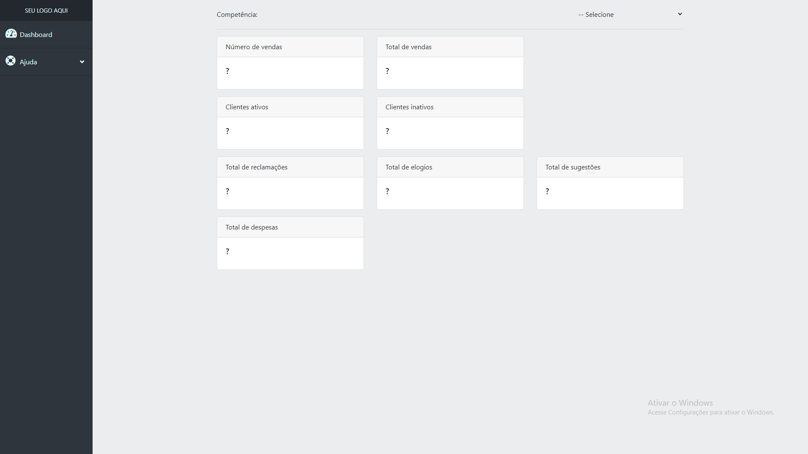
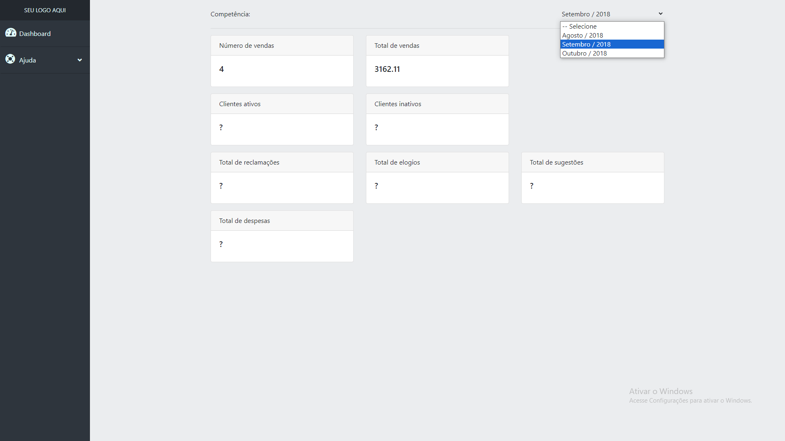

# Dashboard

<p align"center">
  
  
</p>

#  📝 Descrição do projeto

<p>
  Painel de controle para acesso ao número de vendas, e o total de vendas de um determinado período de tempo.
  Os campos input contém o mês e o ano para auxiliar na recuperação dos dados do banco de dados . Quando esses campos forem selecionados, através da biblioteca "JQUERY" é feita uma requisição assíncrona através da  
  metodologia "AJAX" para o servidor. E através do PHP é feita a conexão com o banco de dados, que fornece as informações necessárias para popular os campos do input.
</p>

## Iniciando/Configurando banco de dados

Neste projeto foi usado o "Xampp" (Apache, MySql, PHP, Perl) para acesso ao Local-Host e ao sistema gerenciador de banco de dados. E o objeto nativo "PDO" do PHP para conexão com o banco de dados da aplicação. Segue tutorial:

Conectar a um banco de dados utilizando o objeto PDO (PHP Data Objects) é uma abordagem segura e eficiente para interagir com bancos de dados em PHP. O PDO oferece uma camada de abstração que suporta diversos tipos de bancos de dados, tornando o código mais portável e fácil de manter. Aqui está um exemplo de como você pode conectar a um banco de dados usando o PDO no PHP:

```php
<?php
$host = 'localhost'; // Endereço do servidor de banco de dados
$db_name = 'seu_banco_de_dados'; // Nome do banco de dados
$username = 'seu_usuario'; // Nome de usuário do banco de dados
$password = 'sua_senha'; // Senha do banco de dados

try {
    // Criação de uma nova instância PDO
    $pdo = new PDO("mysql:host=$host;dbname=$db_name;charset=utf8", $username, $password);

    // Configuração de opções de PDO
    $pdo->setAttribute(PDO::ATTR_ERRMODE, PDO::ERRMODE_EXCEPTION);
    $pdo->setAttribute(PDO::ATTR_DEFAULT_FETCH_MODE, PDO::FETCH_ASSOC);

    echo "Conexão bem-sucedida ao banco de dados!";
} catch (PDOException $e) {
    echo "Erro na conexão ao banco de dados: " . $e->getMessage();
}
?>
```

Neste exemplo, você precisará substituir `localhost`, `seu_banco_de_dados`, `seu_usuario` e `sua_senha` pelas informações relevantes do seu banco de dados. Este código estabelece uma conexão com o banco de dados MySQL, mas você pode ajustar os parâmetros conforme necessário para se conectar a outros tipos de bancos de dados suportados pelo PDO.

Após a conexão bem-sucedida, você pode executar consultas SQL usando o objeto `$pdo`. Lembre-se de sempre tratar os erros adequadamente usando blocos `try`...`catch` e de utilizar práticas seguras para evitar injeção de SQL, como consultas preparadas.

Este exemplo é um ponto de partida básico. Dependendo das suas necessidades, você pode modularizar o código, criar classes para gerenciar as operações do banco de dados, implementar funções de tratamento de erros mais avançadas, entre outras melhorias.

<h1> Como utilizar a biblioteca JQUERY ? </h1>

<p> <a href="https://jquery.com/"> Link da documentação: </a> </p>

## Linguagens, dependencias e libs utilizadas :books:

- PHP
- MySQL
- Java-Script
- JQUERY
  
# Tarefas em aberto

:memo: Estruturar o banco de dados, e montar as queries para recuperar as informações de clientes ativos, clientes inativos, total de reclamações, total de elogios, total de despesas


